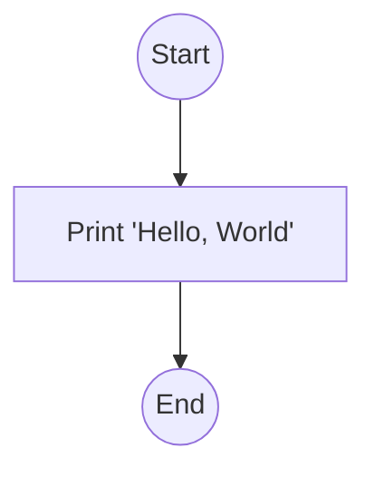
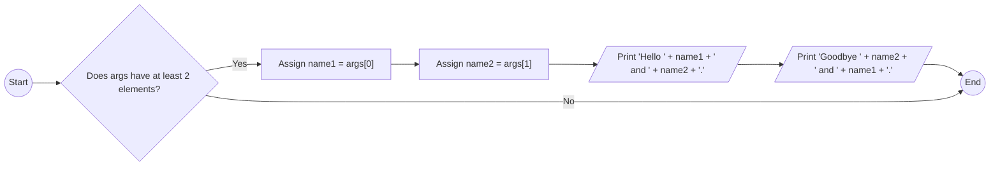
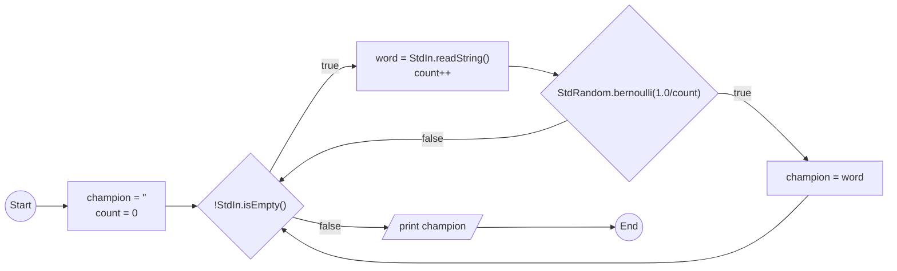
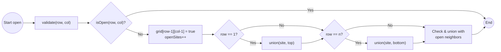
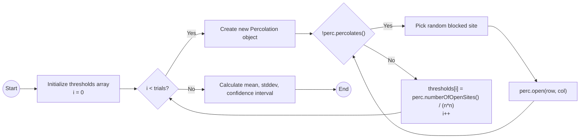
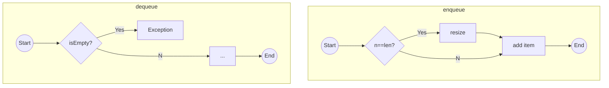
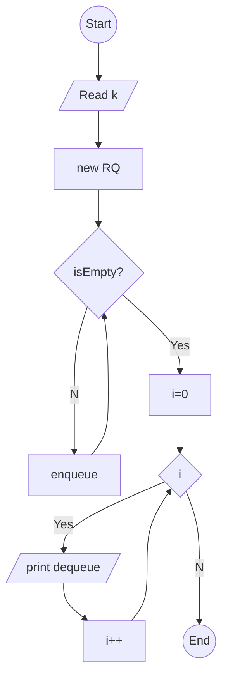

# Guide: Solving Princeton's Algorithms Assignments

This guide documents the complete process used to solve the six programming assignments from Princeton's Algorithms, Part I course, including code implementation, testing, and the generation of a final report with graphical flowcharts.

---

### Chapter 1: Initial Setup

1.  **Directory Structure**: A main folder `finalAnswers` was created. Inside, a separate subdirectory was made for each problem set (`problemSet1`, `problemSet2`, etc.) to keep all related files organized.

2.  **Core Libraries**: The course provides a standard library, `algs4.jar`. This was downloaded from the course website (`http://algs4.cs.princeton.edu/code/algs4.jar`) and placed in each problem set's directory to be used during compilation and execution.

---

### Chapter 2: Solving the Assignments

Each of the six problem sets was solved according to its specification.

-   **Problem Set 1 (Hello, World)**: Implemented basic Java applications to handle standard I/O and command-line arguments.
-   **Problem Set 2 (Percolation)**: Implemented the percolation model using the Weighted Quick-Union Find algorithm to estimate the percolation threshold via Monte Carlo simulation.
-   **Problem Set 3 (Queues)**: Implemented a double-ended queue (`Deque`) with a doubly-linked list and a `RandomizedQueue` with a resizing array.
-   **Problem Set 4 (Collinear Points)**: Implemented brute-force and sorting-based algorithms to find collinear points in a set.
-   **Problem Set 5 (8 Puzzle)**: Implemented the A* search algorithm to solve the 8-puzzle problem. The `Board` data type was optimized to cache the Manhattan distance, and the `Solver` was refined to handle unsolvable puzzles efficiently by running a parallel search on a "twin" board.
-   **Problem Set 6 (Kd-Tree)**: Implemented a brute-force `PointSET` and an optimized `KdTree` to support 2D range search and nearest-neighbor search.

---

### Chapter 3: The Flowchart Challenge

Generating graphical flowcharts was a key requirement. The chosen tool was Mermaid, a simple and powerful language for creating diagrams from text.

#### Solution: Mermaid CLI (`mmdc`)

-   **Idea**: Use the official Mermaid command-line tool (`mmdc`) to convert Mermaid diagram descriptions (`.mmd` files) into PNG images.
-   **Process**:
    1.  **Installation**: The Mermaid CLI was installed via `npm`.
    2.  **Image Generation**: A script loops through all `.mmd` files and uses `mmdc` to generate a PNG image for each. A puppeteer configuration is used to run `mmdc` in a sandbox-less environment, which is necessary in some CI/CD platforms.
        ```bash
        mmdc -i [input_file.mmd] -o [output_file.png] -p puppeteer-config.json
        ```
This approach allows for the automated generation of all flowcharts.

---

### Chapter 4: Compiling the Final Report

With the solution descriptions, source code, and flowchart diagrams in place, the final step is to compile everything into a single, professional-looking PDF document.

#### Solution: Pandoc

-   **Idea**: Use Pandoc, the universal document converter, to convert a consolidated Markdown file into a high-quality PDF.
-   **Process**:
    1.  **Installation**: Pandoc and a LaTeX distribution are installed on the build environment.
    2.  **Consolidation**: A single `Report.md` file is created, which includes the content from `GUIDE.md`, and for each problem set, the Java source code and the Mermaid diagram.
    3.  **PDF Generation**: Pandoc is used to convert `Report.md` to PDF. Pandoc automatically handles syntax highlighting for the Java code and can be configured with a filter to render the embedded Mermaid diagrams.
        ```bash
        pandoc Report.md -o Coursera_Algorithms_Solutions.pdf --from=markdown --template=eisvogel --listings
        ```
This systematic process, combining the power of Mermaid for diagrams and Pandoc for document generation, ensures a fully automated, maintainable, and high-quality report.

---
## Problem Set 1: Hello, World

### HelloWorld

#### Solution Code
```java
public class HelloWorld {
    public static void main(String[] args) {
        System.out.println("Hello, World");
    }
}
```

#### Flowchart


### HelloGoodbye

#### Solution Code
```java
public class HelloGoodbye {
    public static void main(String[] args) {
        if (args.length >= 2) {
            String name1 = args[0];
            String name2 = args[1];
            System.out.println("Hello " + name1 + " and " + name2 + ".");
            System.out.println("Goodbye " + name2 + " and " + name1 + ".");
        }
    }
}
```

#### Flowchart


### RandomWord

#### Solution Code
```java
import edu.princeton.cs.algs4.StdIn;
import edu.princeton.cs.algs4.StdOut;
import edu.princeton.cs.algs4.StdRandom;

public class RandomWord {
    public static void main(String[] args) {
        String champion = "";
        int count = 0;

        while (!StdIn.isEmpty()) {
            String word = StdIn.readString();
            count++;
            if (StdRandom.bernoulli(1.0 / count)) {
                champion = word;
            }
        }
        StdOut.println(champion);
    }
}
```

#### Flowchart


---
## Problem Set 2: Percolation

### Percolation

#### Solution Code
```java
import edu.princeton.cs.algs4.WeightedQuickUnionUF;

public class Percolation {
    private final boolean[][] grid;
    private final int n;
    private final WeightedQuickUnionUF uf;
    private final int topVirtualSite;
    private final int bottomVirtualSite;
    private int openSites;

    // creates n-by-n grid, with all sites initially blocked
    public Percolation(int n) {
        if (n <= 0) {
            throw new IllegalArgumentException("n must be > 0");
        }
        this.n = n;
        this.grid = new boolean[n][n];
        this.uf = new WeightedQuickUnionUF(n * n + 2);
        this.topVirtualSite = n * n;
        this.bottomVirtualSite = n * n + 1;
        this.openSites = 0;
    }

    // opens the site (row, col) if it is not open already
    public void open(int row, int col) {
        validate(row, col);
        if (!isOpen(row, col)) {
            grid[row - 1][col - 1] = true;
            openSites++;
            int siteIndex = xyTo1D(row, col);

            if (row == 1) {
                uf.union(siteIndex, topVirtualSite);
            }
            if (row == n) {
                uf.union(siteIndex, bottomVirtualSite);
            }

            // check and union with neighbors
            if (row > 1 && isOpen(row - 1, col)) {
                uf.union(siteIndex, xyTo1D(row - 1, col));
            }
            if (row < n && isOpen(row + 1, col)) {
                uf.union(siteIndex, xyTo1D(row + 1, col));
            }
            if (col > 1 && isOpen(row, col - 1)) {
                uf.union(siteIndex, xyTo1D(row, col - 1));
            }
            if (col < n && isOpen(row, col + 1)) {
                uf.union(siteIndex, xyTo1D(row, col + 1));
            }
        }
    }

    // is the site (row, col) open?
    public boolean isOpen(int row, int col) {
        validate(row, col);
        return grid[row - 1][col - 1];
    }

    // is the site (row, col) full?
    public boolean isFull(int row, int col) {
        validate(row, col);
        return uf.find(xyTo1D(row, col)) == uf.find(topVirtualSite);
    }

    // returns the number of open sites
    public int numberOfOpenSites() {
        return openSites;
    }

    // does the system percolate?
    public boolean percolates() {
        return uf.find(topVirtualSite) == uf.find(bottomVirtualSite);
    }

    private void validate(int row, int col) {
        if (row < 1 || row > n || col < 1 || col > n) {
            throw new IllegalArgumentException("row and col must be between 1 and " + n);
        }
    }

    private int xyTo1D(int row, int col) {
        return (row - 1) * n + (col - 1);
    }
}
```

#### Flowchart


### PercolationStats

#### Solution Code
```java
import edu.princeton.cs.algs4.StdRandom;
import edu.princeton.cs.algs4.StdStats;
import edu.princeton.cs.algs4.Stopwatch;

public class PercolationStats {

    private static final double CONFIDENCE_95 = 1.96;
    private final double[] thresholds;
    private final int trials;

    // perform independent trials on an n-by-n grid
    public PercolationStats(int n, int trials) {
        if (n <= 0 || trials <= 0) {
            throw new IllegalArgumentException("n and trials must be > 0");
        }
        this.trials = trials;
        this.thresholds = new double[trials];
        for (int i = 0; i < trials; i++) {
            Percolation perc = new Percolation(n);
            while (!perc.percolates()) {
                int row = StdRandom.uniform(1, n + 1);
                int col = StdRandom.uniform(1, n + 1);
                perc.open(row, col);
            }
            thresholds[i] = (double) perc.numberOfOpenSites() / (n * n);
        }
    }

    // sample mean of percolation threshold
    public double mean() {
        return StdStats.mean(thresholds);
    }

    // sample standard deviation of percolation threshold
    public double stddev() {
        return StdStats.stddev(thresholds);
    }

    // low endpoint of 95% confidence interval
    public double confidenceLo() {
        return mean() - (CONFIDENCE_95 * stddev() / Math.sqrt(trials));
    }

    // high endpoint of 95% confidence interval
    public double confidenceHi() {
        return mean() + (CONFIDENCE_95 * stddev() / Math.sqrt(trials));
    }

    // test client (see below)
    public static void main(String[] args) {
        int n = Integer.parseInt(args[0]);
        int T = Integer.parseInt(args[1]);

        Stopwatch timer = new Stopwatch();
        PercolationStats stats = new PercolationStats(n, T);
        double time = timer.elapsedTime();

        System.out.println("mean                    = " + stats.mean());
        System.out.println("stddev                  = " + stats.stddev());
        System.out.println("95% confidence interval = [" + stats.confidenceLo() + ", " + stats.confidenceHi() + "]");
        System.out.println("elapsed time            = " + time);
    }
}
```

#### Flowchart


---
## Problem Set 3: Queues

### Deque

#### Solution Code
```java
import java.util.Iterator;
import java.util.NoSuchElementException;

public class Deque<Item> implements Iterable<Item> {

    private class Node {
        Item item;
        Node next;
        Node prev;
    }

    private Node first;
    private Node last;
    private int size;

    // construct an empty deque
    public Deque() {
        first = null;
        last = null;
        size = 0;
    }

    // is the deque empty?
    public boolean isEmpty() {
        return size == 0;
    }

    // return the number of items on the deque
    public int size() {
        return size;
    }

    // add the item to the front
    public void addFirst(Item item) {
        if (item == null) {
            throw new IllegalArgumentException();
        }
        Node oldFirst = first;
        first = new Node();
        first.item = item;
        first.next = oldFirst;
        first.prev = null;
        if (isEmpty()) {
            last = first;
        } else {
            oldFirst.prev = first;
        }
        size++;
    }

    // add the item to the back
    public void addLast(Item item) {
        if (item == null) {
            throw new IllegalArgumentException();
        }
        Node oldLast = last;
        last = new Node();
        last.item = item;
        last.next = null;
        last.prev = oldLast;
        if (isEmpty()) {
            first = last;
        } else {
            oldLast.next = last;
        }
        size++;
    }

    // remove and return the item from the front
    public Item removeFirst() {
        if (isEmpty()) {
            throw new NoSuchElementException();
        }
        Item item = first.item;
        first = first.next;
        size--;
        if (isEmpty()) {
            last = null;
        } else {
            first.prev = null;
        }
        return item;
    }

    // remove and return the item from the back
    public Item removeLast() {
        if (isEmpty()) {
            throw new NoSuchElementException();
        }
        Item item = last.item;
        last = last.prev;
        size--;
        if (isEmpty()) {
            first = null;
        } else {
            last.next = null;
        }
        return item;
    }

    // return an iterator over items in order from front to back
    public Iterator<Item> iterator() {
        return new DequeIterator();
    }

    private class DequeIterator implements Iterator<Item> {
        private Node current = first;

        public boolean hasNext() {
            return current != null;
        }

        public void remove() {
            throw new UnsupportedOperationException();
        }

        public Item next() {
            if (!hasNext()) {
                throw new NoSuchElementException();
            }
            Item item = current.item;
            current = current.next;
            return item;
        }
    }

    // unit testing (required)
    public static void main(String[] args) {
        Deque<Integer> deque = new Deque<>();
        System.out.println("Is empty? " + deque.isEmpty());
        deque.addFirst(1);
        deque.addLast(2);
        System.out.println("Size: " + deque.size());
        for (int i : deque) {
            System.out.println(i);
        }
        System.out.println("Removed first: " + deque.removeFirst());
        System.out.println("Removed last: " + deque.removeLast());
        System.out.println("Size: " + deque.size());
    }
}
```

#### Flowchart


```mermaid
graph TD;
    subgraph "addFirst(item)"
    A1((Start)) --> B1{"Is the item null?"};
    B1 -- "No (Valid item)" --> C1["Create new node and update links"];
    B1 -- "Yes (Invalid)" --> D1["Throw IllegalArgumentException"];
    C1 --> E1{"Is the deque empty?"};
    E1 -- "No (Existing elements)" --> F1["Link old first to new first"];
    E1 -- "Yes (First element)" --> G1["Set last = first"];
    F1 --> H1["Increment size"];
    G1 --> H1;
    H1 --> I1((End));
    end;

    subgraph "removeLast()"
    A2((Start)) --> B2{"Is the deque empty?"};
    B2 -- "No (Contains items)" --> C2["Retrieve item from last"];
    B2 -- "Yes (Empty)" --> D2["Throw NoSuchElementException"];
    C2 --> E2["Set last = last.prev"];
    E2 --> F2["Decrement size"];
    F2 --> G2{"Is the deque now empty?"};
    G2 -- "No (Still has items)" --> H2["Set last.next = null"];
    G2 -- "Yes (Now empty)" --> I2["Set first = null"];
    H2 --> J2((End));
    I2 --> J2;
    end;
```

### RandomizedQueue

#### Solution Code
```java
import java.util.Iterator;
import java.util.NoSuchElementException;
import edu.princeton.cs.algs4.StdRandom;

public class RandomizedQueue<Item> implements Iterable<Item> {

    private Item[] q;
    private int n;

    // construct an empty randomized queue
    public RandomizedQueue() {
        q = (Item[]) new Object[2];
        n = 0;
    }

    // is the randomized queue empty?
    public boolean isEmpty() {
        return n == 0;
    }

    // return the number of items on the randomized queue
    public int size() {
        return n;
    }

    private void resize(int capacity) {
        assert capacity >= n;
        Item[] temp = (Item[]) new Object[capacity];
        for (int i = 0; i < n; i++) {
            temp[i] = q[i];
        }
        q = temp;
    }

    // add the item
    public void enqueue(Item item) {
        if (item == null) {
            throw new IllegalArgumentException();
        }
        if (n == q.length) {
            resize(2 * q.length);
        }
        q[n++] = item;
    }

    // remove and return a random item
    public Item dequeue() {
        if (isEmpty()) {
            throw new NoSuchElementException();
        }
        int rand = StdRandom.uniform(n);
        Item item = q[rand];
        q[rand] = q[n - 1];
        q[n - 1] = null;
        n--;
        if (n > 0 && n == q.length / 4) {
            resize(q.length / 2);
        }
        return item;
    }

    // return a random item (but do not remove it)
    public Item sample() {
        if (isEmpty()) {
            throw new NoSuchElementException();
        }
        return q[StdRandom.uniform(n)];
    }

    // return an independent iterator over items in random order
    public Iterator<Item> iterator() {
        return new RandomizedQueueIterator();
    }

    private class RandomizedQueueIterator implements Iterator<Item> {
        private final Item[] items;
        private int current;

        public RandomizedQueueIterator() {
            items = (Item[]) new Object[n];
            for (int i = 0; i < n; i++) {
                items[i] = q[i];
            }
            StdRandom.shuffle(items);
            current = 0;
        }

        public boolean hasNext() {
            return current < n;
        }

        public void remove() {
            throw new UnsupportedOperationException();
        }

        public Item next() {
            if (!hasNext()) {
                throw new NoSuchElementException();
            }
            return items[current++];
        }
    }

    // unit testing (required)
    public static void main(String[] args) {
        RandomizedQueue<Integer> rq = new RandomizedQueue<>();
        System.out.println("Is empty? " + rq.isEmpty());
        rq.enqueue(1);
        rq.enqueue(2);
        rq.enqueue(3);
        System.out.println("Size: " + rq.size());
        System.out.println("Sample: " + rq.sample());
        for (int i : rq) {
            System.out.println(i);
        }
        System.out.println("Dequeued: " + rq.dequeue());
        System.out.println("Size: " + rq.size());
    }
}
```

#### Flowchart


### Permutation

#### Solution Code
```java
import edu.princeton.cs.algs4.StdIn;

public class Permutation {
    public static void main(String[] args) {
        int k = Integer.parseInt(args[0]);
        RandomizedQueue<String> rq = new RandomizedQueue<>();
        while (!StdIn.isEmpty()) {
            rq.enqueue(StdIn.readString());
        }
        for (int i = 0; i < k; i++) {
            System.out.println(rq.dequeue());
        }
    }
}
```

#### Flowchart

