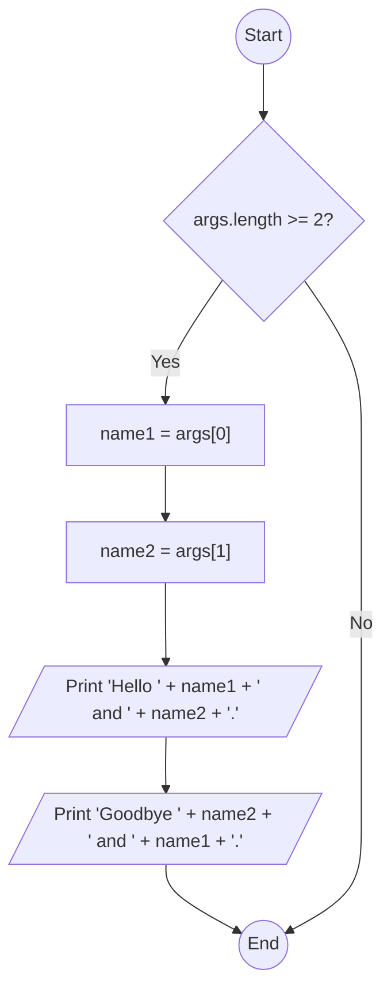

```mermaid
graph TD;
    A((Start)) --> B{"args.length >= 2?"};
    B -- Yes --> C["name1 = args[0]"];
    C --> D["name2 = args[1]"];
    D --> E[/ "Print 'Hello ' + name1 + ' and ' + name2 + '.'" /];
    E --> F[/ "Print 'Goodbye ' + name2 + ' and ' + name1 + '.'" /];
    F --> G((End));
    B -- No --> G;
```
